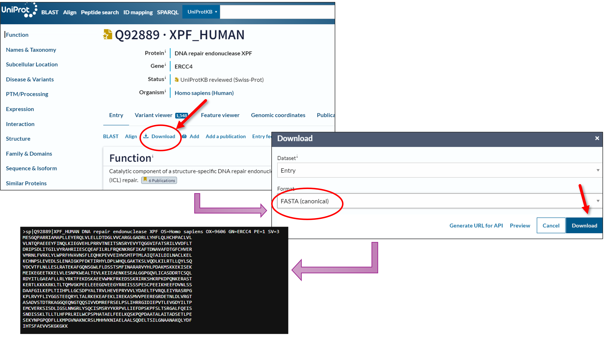
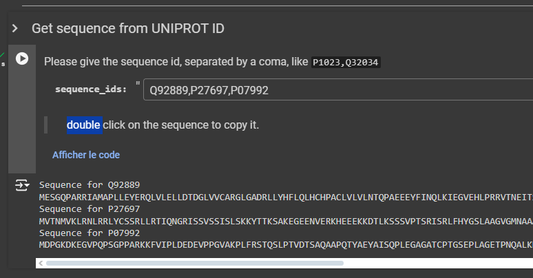
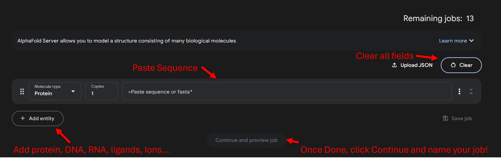
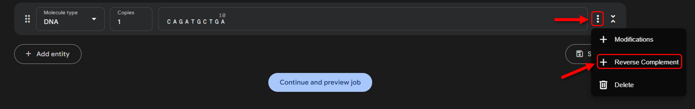
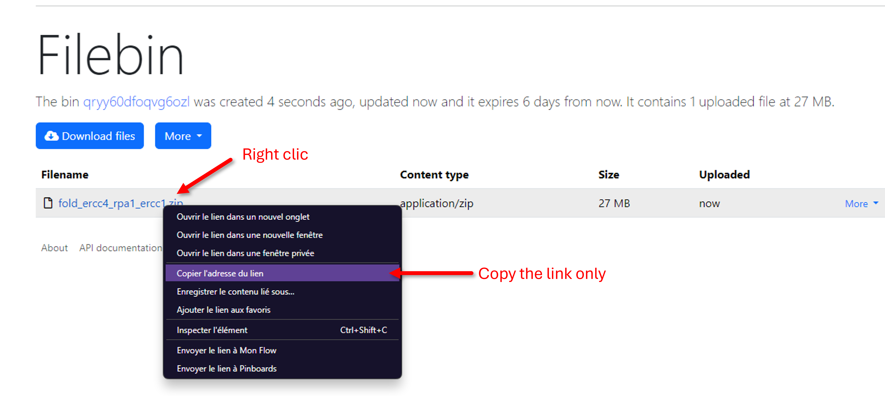
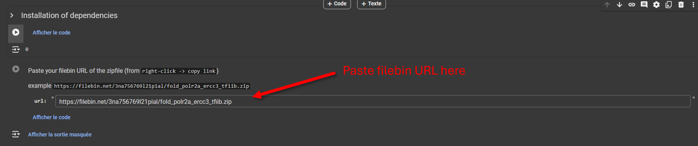
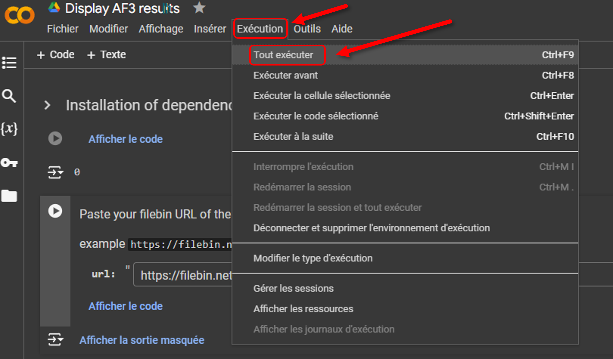

AI and Biology Training
=======================
This repository aims to provide the very basic keys of AlphaFold model analysis for a practical given to the summer school AI & Biology and Genetics organized by the Université Paris Cité (https://premc.org/ia-summerschool2024-upc/)  
The examples are fairly simple and google notebook are used to generate outputs.

# REQUIREMENT : 

```diff
- So that the maximum number of attendants can produce models, we will use the AlphaFold 3 Google web server: https://golgi.sandbox.google.com.  
- This implies that everyone has a Google account.
```

# Aim of the Practical
This *short* practical aims to make models of different protein + DNA interactions.  
**Context**  
My biologist colleagues study 3 proteins: XPF, RPA1, and ERCC1.  
`XPF` and `ERCC1` are proteins involved in the DNA repair process, and `RPA1` is a protein that binds and stabilizes single-stranded DNA intermediates during DNA replication.
They told me that ERCC4 and ERCC1 interact, but they are not sure about RPA1. They are seeing some signs of interactions in their experiments, but they think it might be an artifact. They asked me to check if:  
1. Do XPF and ERCC1 interact together? 
2. Is there a triad between ERCC4, ERCC1, and RPA1? 
3. Can I give them an idea of the binding? 
4. These proteins are involved in DNA binding. Where could they interact with the DNA?
 
To answer their questions, We will make models of different proteins: 
- `XPF` + `ERCC1`
- `XPF` + `RPA1` + `ERCC1`
- `XPF` + `ERCC1` + `DNA sequence`

## Uniprot IDS

**Element**|**ID/Sequence**
:-----:|:-----:
XPF|Q92889
RPA1|P27697
ERCC1|P07992
DNA|CAGATGCTGA

# A. Generating Models
## 1. Fetching Sequences

The first thing to do to model a protein from the sequence is to get the sequence.  
Here we will try 2 models with 2 and then 3 proteins.

To get the sequence, two options are possible: 
1. The "original" one, go to https://www.uniprot.org/ and paste the Uniprot Code in the search field, download the fasta by clicking on `Download`, and copy the sequence.  
**HOWEVER**, AlphaFold3 web server requires a **linear** sequence (without line breaks). So either remove it... Or use option 2 😉 <details close> <summary>example on uniprot</summary> 
   </details>
2. For the sake of this practical, to avoid losing too much time on details, I have prepared a ColabFold notebook to print the sequence from a list of Uniprot IDs. ➡️ <a target="_blank" href="https://colab.research.google.com/github/tubiana/practicals_AI-biology-genetics/blob/main/Get_sequence_for_AF3.ipynb"></a>
   

## 2. Generating Models with AF3
1. Go to the [AlphaFold3 Web Server](https://golgi.sandbox.google.com)
2. Log in with your Google Account
3. Click on Clear to have a fresh new form
4. Paste the sequences.  

5. **NOTE**: When adding a DNA sequence, you can add the reverse complement directly by clicking on the menu (3 dots) and then `Reverse complement`  


# B. Analyzing the Models

Analyzing the AlphaFold models could be a full-day course by itself...  
Today we will focus only on the pLDDT and PAE matrix to check: 
1. Is the model quality good? 
2. Can we detect interaction from the PAE matrix? 
3. Check the models visually with py3Dmol in the navigator. 

**NOTE**: Since the outputs generated from the AF3 web server compared to AF2 are significantly reduced, for the sake of time I have prepared a Google Colab notebook to upload your data, and the pLDDT + PAE matrices will be displayed. This notebook was prepared with the [`af2_analysis` package from Samuel Murail](https://github.com/samuelmurail/af2_analysis).

Once the models are done, you can download them, but I will ask you to upload them to a server so that you can download them directly in the Google Colab notebook. The easiest server I found is https://filebin.net. 
1. Download the results archive (in zip) by clicking on the menu button right after the job name.
2. Upload them on https://filebin.net and copy the direct link only.  

3. Open the [analysis notebook](https://colab.research.google.com/github/tubiana/practicals_AI-biology-genetics/blob/main/Display_AF3_results.ipynb) and paste it in the field. ➡️ <a target="_blank" href="https://colab.research.google.com/github/tubiana/practicals_AI-biology-genetics/blob/main/Display_AF3_results.ipynb"> </a>  

4. `Runtime > Run all`.  

5. Wait a few minutes, and check the results 😉


## Questions
To help the biologist with their issue, answer those questions : 
1. Is there any disordered regions ?
2. Are XPF and ERCC1 interact together ?
3. Are XPF and RPA1 or ERCC1 and RPA1 interact together ?
4. Where could be located the DNA ?
5. How confident are you with the DNA location ?


